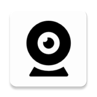

<h1 align="center">
  <sub>
    
  </sub>
  <br>
  OpenCam
</h1>

<p align="center">
  Turn your Android phone into a wireless camera for your computer.
</p>

<p align="center">
  <a href="https://github.com/prem-nyx/OpenCam/blob/main/LICENSE">
    
  </a>
  <a href="https://github.com/prem-nyx/OpenCam">
    
  </a>
</p>

<p align="center">
  <strong>OpenCam</strong> is an open-source project for turning an Android device into a
  network camera that can be used by applications on a computer.
</p>

---

## Table of Contents

1. [About OpenCam](#about-opencam)
2. [Current Status](#current-status)
3. [Architecture](#architecture)
4. [Milestones](#milestones)
5. [Repository Structure](#repository-structure)
6. [Linux Controller](#linux-controller)
7. [Android Application](#android-application)
8. [Windows Implementation](#windows-implementation)
9. [Building](#building)
10. [Project Origin](#project-origin)
11. [Contributing](#contributing)
12. [License](#license)

---

## About OpenCam

OpenCam is an open-source attempt to turn an Android smartphone into a
general-purpose camera source for a computer.

The project uses the Android device's camera, streams the video over the network,
and bridges that stream into a virtual camera device on the computer.

The long-term goal is to provide a flexible camera platform that can work across
Linux and Windows, support multiple transport methods, and eventually provide
both video and audio capabilities.

OpenCam is currently under active development.

---

## Current Status

### Milestone 1 — Android → Linux Video Pipeline

**Complete**

The first milestone established the complete media path:

```text
Android Camera
      │
      ▼
VCamdroid RTSP Server
      │
      │ Wi-Fi
      ▼
Linux
      │
      ▼
FFmpeg
      │
      ▼
V4L2 Loopback
      │
      ▼
/dev/video*
      │
      ▼
OBS / Webcam Applications
```

The Android device successfully streams camera video to Linux,
where FFmpeg converts the RTSP stream into a V4L2 virtual camera.

---

### Milestone 2 — OpenCam Linux Controller

**Complete**

Milestone 2 replaced the temporary Python controller with a native C++17
Linux controller.

The controller currently provides:

- Dynamic QR-code pairing
- TCP control connection
- Android device descriptor parsing
- Native activation packet generation
- RTSP readiness detection
- FFmpeg process management
- Dynamic V4L2 device discovery
- V4L2 loopback integration
- Client disconnect handling
- Automatic reconnection without restarting OpenCam

The current validated video configuration is:

```text
Resolution: 640 × 480
Framerate: 30 FPS
Codec: H.264
Pixel format: YUV420P
Transport: RTSP over TCP
Output: V4L2 loopback
```

End-to-end latency during milestone validation was approximately
2–4 seconds, with smooth video playback.

---

## Architecture

The current Linux video architecture is:

```text
┌──────────────────────┐
│    Android Camera   │
└──────────┬───────────┘
           │
           │ RTSP
           ▼
┌──────────────────────┐
│ Android RTSP Server │
│      Port 8554      │
└──────────┬───────────┘
           │
           │ Wi-Fi
           ▼
┌──────────────────────┐
│  OpenCam Controller  │
│       Linux          │
│      Port 6969       │
└──────────┬───────────┘
           │
           │ FFmpeg
           ▼
┌──────────────────────┐
│   V4L2 Loopback      │
│    /dev/video*       │
└──────────┬───────────┘
           │
           ▼
┌──────────────────────┐
│ OBS / Browser /      │
│ Webcam Applications  │
└──────────────────────┘
```

The control and media paths are currently separate:

```text
Control:
Android ───── TCP :6969 ─────> OpenCam

Video:
Android ───── RTSP :8554 ────> FFmpeg ───> V4L2
```

Security improvements to these paths are planned for a future milestone.

---

## Milestones

| Milestone | Description | Status |
|---|---|---|
| M1 | Android → Linux video pipeline | ✅ Complete |
| M2 | Native Linux controller | ✅ Complete |
| M3 | Pairing & network security | 🔜 Next |
| M4 | Resolution, performance & latency | Planned |
| M5 | USB / ADB transport | Planned |
| M6 | Audio & A/V synchronization | Planned |
| M7 | Android UI & OpenCam rebrand | Planned |
| M8 | Windows implementation | Planned |
| M9 | Packaging, release & final testing | Planned |

The roadmap may evolve as development continues.

---

## Repository Structure

```text
OpenCam/
│
├── android/
│   └── Android application
│
├── linux/
│   ├── CMakeLists.txt
│   └── src/
│       ├── device_descriptor.*
│       ├── ffmpeg_runner.*
│       ├── main.cpp
│       ├── network.*
│       ├── qr.*
│       ├── rtsp_probe.*
│       ├── stream_options.*
│       └── v4l2_device.*
│
├── windows/
│   └── Original Windows implementation
│
├── Docs/
│   ├── OpenCam_Milestone_1_Report.md
│   └── OpenCam_Milestone_2_Report.md
│
├── imgs/
├── LICENSE
└── README.md
```

---

## Linux Controller

The Linux implementation is written in **C++17** and uses CMake.

The current controller is responsible for:

1. Determining the local IPv4 address.
2. Generating a pairing QR code.
3. Accepting the Android TCP connection.
4. Receiving and parsing the Android device descriptor.
5. Detecting the OpenCam V4L2 loopback device.
6. Sending the Android activation packet.
7. Waiting for the Android RTSP server.
8. Starting FFmpeg.
9. Writing the decoded video into the V4L2 loopback device.
10. Cleaning up when the Android device disconnects.
11. Accepting another Android connection.

### Linux Dependencies

The current implementation requires:

- C++17 compiler
- CMake
- FFmpeg
- FFprobe
- `qrencode`
- `v4l2loopback`

The V4L2 loopback module is currently treated as a system prerequisite.

Automatic installation and system integration are planned for a future
packaging milestone.

### Building

From the repository root:

```bash
cd linux
cmake -S . -B build
cmake --build build
```

The resulting executable is:

```text
linux/build/opencam
```

---

## Android Application

The Android application is currently based on the Android side of the
original VCamdroid implementation.

It currently provides the camera capture and RTSP streaming functionality
used by the Linux controller.

The Android application communicates with the computer using the project's
TCP control protocol and provides an RTSP stream containing the camera video.

The Android source package currently retains the original:

```text
com.darusc.vcamdroid
```

namespace.

The Android-side rebranding and restructuring are planned for a future
milestone.

---

## Windows Implementation

The repository currently contains the original VCamdroid Windows
implementation.

The Windows implementation uses:

- C++
- DirectShow
- FFmpeg
- Softcam
- ADB

It remains in the repository as the existing Windows baseline while
OpenCam development focuses on the Linux implementation.

A dedicated OpenCam Windows implementation is planned for a future milestone.

---

## Project Origin

OpenCam builds upon the original
[VCamdroid](https://github.com/darusc/VCamdroid) project created by
**darusc**.

The original project provided the foundation for the Android camera
application, RTSP streaming architecture, and Windows implementation.

OpenCam extends that foundation with a new project direction focused on:

- Linux support
- Native Linux control
- V4L2 virtual camera output
- Cross-platform architecture
- Secure device pairing
- Multiple network transport modes
- Improved resolution and performance handling
- Future audio support
- Future USB / ADB transport
- OpenCam-specific Android and desktop interfaces

Original VCamdroid code and third-party components remain subject to their
respective licenses.

---

## Contributing

OpenCam is currently under active development.

Contributions, experiments, bug reports, documentation improvements, and
technical discussions are welcome.

Before making significant changes, please check the current milestone and
project documentation in the `Docs/` directory.

### Development Principles

OpenCam development follows a few principles:

- Prefer established protocols and standards.
- Avoid unnecessary complexity.
- Do not reinvent cryptographic primitives.
- Verify behavior experimentally where possible.
- Keep platform-specific code isolated.
- Preserve working functionality while introducing new architecture.
- Document significant engineering decisions.

---

## License

OpenCam is distributed under the license included in this repository.

See [`LICENSE`](LICENSE) for details.

---

<p align="center">
  Built by <strong>V3NOM</strong> (<a href="https://github.com/prem-nyx">@prem-nyx</a>)
</p>
